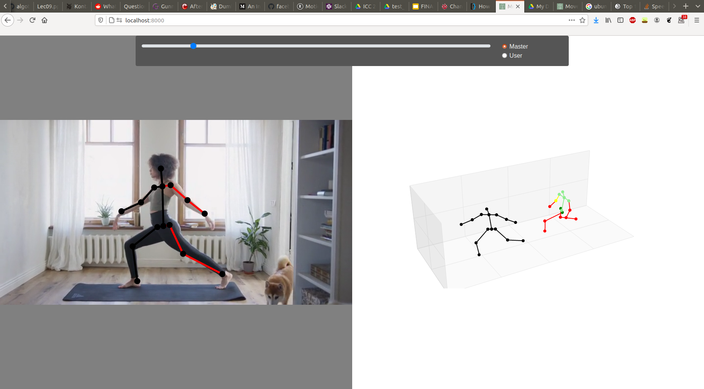

# Movement Coach Server

Server repository for the [ICC 2020](https://www.createchallenge.org/) submission of the Movement Coach team. The first part of the final submission can be found in [this repository](https://github.com/brunovollmer/icc_dope_estimator). More information can be found on [DevPost](https://devpost.com/software/movement-coach).

Please consider that this prototype was created during a hackathon with the main focus on speed. Code and comment quality may vary :)

## Examples

Below is an example of the UI shown where the user can compare his 2D and 3D pose against the before computed master poses.



## License

The code is distributed under the CC BY-NC-SA 4.0 License. See [LICENSE](LICENSE) for more information.

## Getting started


Create a virtual python environment and install all required packages.
```
python3 -m venv venv
source venv/bin/activate
pip install -r requirements.txt
```
Additionally `ffmpeg` should also be installed on your system.

Clone the submodules with
```
git submodule update --init --recursive
```

Next step is to follow the installation instructions for the estimator submodule, especially setting up the model, [here](https://github.com/brunovollmer/icc_dope_estimator).

You can change the path to the model checkpoint in the settings in `main.py` or link the models directory of the submodule via
```shell script
ln -s lib/dope_estimator/models models
```

## Using the code

Run server in debug mode (with auto reload for example):
```shell script
adev runserver app
```
